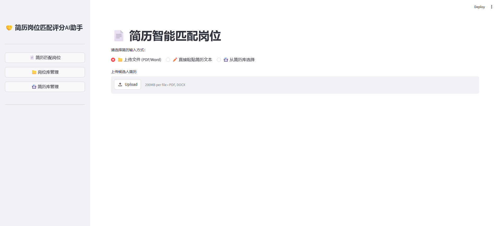
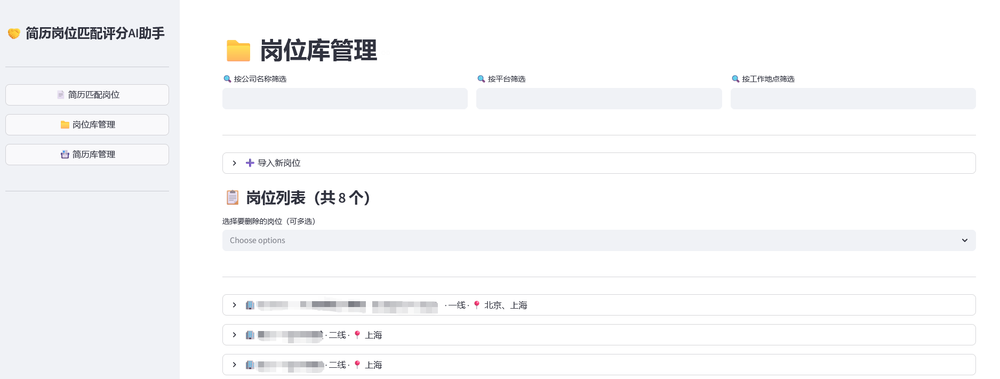
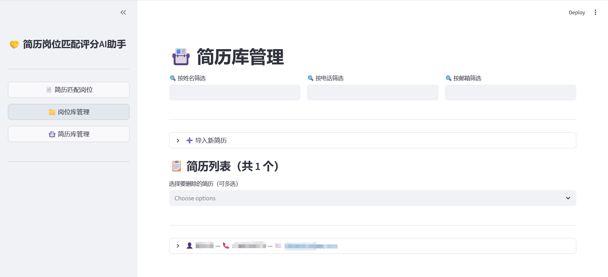

# AI岗位简历匹配助手

[](https://opensource.org/licenses/MIT)
[](https://www.python.org/downloads/)

基于腾讯混元大模型的智能招聘匹配工具，通过向量检索与 AI 多维度评分，帮助高效匹配候选人与岗位，适用社招招聘（可能），碎碎念放在最底下。

已更新到1.0.1版本，此版本现在支持双向匹配，包括简历匹配岗位，岗位匹配合适候选人！还更新了简历库和岗位库分开管理部分，支持了excel格式传入。
已更新至1.0.2版本，该版本优化了页面切换延迟问题，使用体验增加upup~

当然，现在依旧还是demo状态，技术还是很简单，之后的方向可能会考虑新增信息mapping部分；
也可能重构前后端，干脆作为招聘工作者的个人工作站来考虑优化方向。

## 功能亮点

-  **岗位管理**：支持岗位手动/excel录入、向量化存储、筛选、查看和删除，可一键为岗位匹配候选人（目前是本地存储，支持体量不大的个人用户）
-  **简历解析**：支持 PDF/Word 文件上传，也可直接粘贴纯文本（缓冲很慢，还在调整）
-  **简历管理**：手动录入或 Excel 批量导入简历，支持按姓名/电话/邮箱筛选，多选批量删除,自动向量化存储，随时调用匹配
-  **向量初筛**：基于混元 Embedding 模型计算语义相似度。（调用）
-  **AI 严格评分**：五维度（工作经验/核心技能/教育背景/项目成就/稳定性）综合评估（提示词严格设定了一部分评分参考，可自行优化）
-  **并发优化**：Top3 岗位并发调用 AI，大幅缩短等待时间（没评估并发快了夺少）
-  **性能优化**：引入 Streamlit 缓存机制，页面切换upup，减少不必要的重跑，使用感++（v1.0.2）
## 技术栈

| 层级 | 技术 |
|------|------|
| 前端界面 | Streamlit |
| 向量嵌入 | 腾讯混元 Embedding API |
| AI 评分 | 腾讯混元 Chat API (hunyuan-2.0-instruct) |
| 数据库 | SQLite3 |
| 文件解析 | PyPDF2、python-docx、pandas、openpyxl |
| 并发处理 | ThreadPoolExecutor |

## 快速开始

### 环境要求
- Python 3.8+
- 腾讯云 API 密钥（需开通混元大模型服务）
- TokenHub API 密钥

### 安装步骤

1. 克隆项目
```bash
git clone https://github.com/Senuchy/hunter-ai-matcher.git
cd hunter-ai-matcher
```
2. 安装依赖
```bash
pip install -r requirements.txt
```
3. 配置环境变量
```bash
cp .env.example .env
#编辑.env文件，填入你的API密钥
```
4. 启动应用
```bash
streamlit run app.py
```
## 使用说明
### 1. 简历匹配岗位（默认首页）
- 选择简历输入方式：上传文件 / 直接粘贴 / 从简历库选择

- 点击 「开始匹配岗位」 按钮

- 系统自动完成向量初筛与 AI 并发评分，展示 Top3 推荐结果

- 展开卡片可查看 AI 评分、匹配理由及五维度详细分析

### 2. 岗位库管理
- 手动录入：点击「导入新岗位」→「手动录入」，填写各项信息（岗位名称与 JD 为必填），保存后自动生成向量。

- Excel 批量导入：点击「导入新岗位」→「Excel批量导入」，上传符合模板的 Excel 文件。

- 筛选与删除：使用顶部筛选框快速定位岗位，支持多选批量删除。

- 匹配候选人：点击岗位卡片下方的 「 匹配候选人」 按钮，将跳转至反向匹配页面。
### 3. 简历库管理
- 手动录入：点击「导入新简历」→「手动录入」，填写姓名、简历正文（必填）及其他可选字段。

- Excel 批量导入：点击「导入新简历」→「Excel批量导入」，上传符合模板的 Excel 文件。

- 筛选与删除：支持按姓名/电话/邮箱筛选，支持多选批量删除。
### 4. 岗位匹配候选人
- 从岗位库进入后，页面顶部显示当前岗位信息

- 点击 「开始匹配候选人」，系统计算向量相似度并取 Top10

- AI 对 Top3 候选人进行五维度评分，展示联系方式及详细分析

- 备选区域显示 Top4~10 候选人的向量相似度

## 截图展示

### 📄 简历智能匹配岗位


### 📁 岗位库管理


### 📇 简历库管理



##  项目架构
```text
Streamlit 多页面应用
├── 侧边栏导航（页面切换）
├── 缓存层
├── 简历匹配岗位（首页）
│   ├── 简历输入（文件/粘贴/库选）
│   ├── 向量初筛 → Top5
│   └── AI 并发评分 Top3
├── 岗位库管理
│   ├── 手动录入 / Excel 批量导入
│   ├── 筛选、多选删除
│   └── 跳转匹配候选人
├── 简历库管理
│   ├── 手动录入 / Excel 批量导入
│   ├── 筛选、多选删除
│   └── 向量化存储
└── 岗位匹配候选人
    ├── 向量相似度计算 → Top10
    ├── AI 并发评分 Top3
    └── 候选人详情展示
```
## 项目库结构
```text
hunter-ai-matcher/
├── app.py
├── requirements.txt
├── .env.example
├── .gitignore
├── LICENSE
├── README.md
└── screenshots/                    
    ├── match-resume-to-job.png     
    ├── job-library.png             
    ├── resume-library.png          
    └── and so on...
```

##  待办事项
- 支持自定义评分维度权重
- 继续优化界面显示体验
- ···
- 还在思考，可能考虑更换数据库技术栈、重构前端框架之类的，可能还会分开招聘端和个人求职端，再分别更新可能需求。

## 更新日志
1.0.2 (2026-04-28)

- 引入 `@st.cache_resource` 缓存数据库连接与 API 客户端，页面切换不再重复创建

- 引入 `@st.cache_data` 缓存岗位/简历列表查询与 Embedding 向量，相同请求秒返回

- 新增缓存失效机制：数据增删改后自动清除相关缓存，保证数据一致性

- 移除侧边栏导航按钮的冗余 `st.rerun()`，减少不必要的脚本重跑

- 修复小小显示 bug

v1.0.1 (2026-04-22)

- 重构为多页面专业工作台（一点也不专业）

- 新增岗位库管理（手动录入、Excel 批量导入、字段扩展、筛选删除）

- 新增简历库管理（手动录入、Excel 批量导入、字段扩展、筛选删除）

- 新增「岗位匹配候选人」反向检索功能

- 优化界面布局与交互体验


##  贡献
欢迎提交 Issue 和 Pull Request！

##  许可证
本项目采用 MIT License 开源。

## 碎碎念
其实暂时还没帮自己工作什么，暂时是只在看不懂简历（招聘端），以及纠结自己投什么岗位（求职端）的时候，突发奇想想要做一个帮帮忙。但是优化功能可能还需要走一段路程。需要解决的问题还有很多，比如如何花最少的token给出最精准的答案/减少时间/服务器部署否/数据库租用否...之类的，至少自己用起来还不好用，等我觉得好用了，这个项目就打算结束了！（1.0.1）
现在的使用感已经upup了，已经是自己会愿意使用的程度了，omo，争取涵盖完整工作流。页面切换终于不卡了！之前每次点侧边栏都要等好几秒，现在秒切。主要是之前每次 rerun 都重新建数据库连接、重新创建 API 客户端、重新查一遍数据库，现在全缓存起来了。（1.0.2）