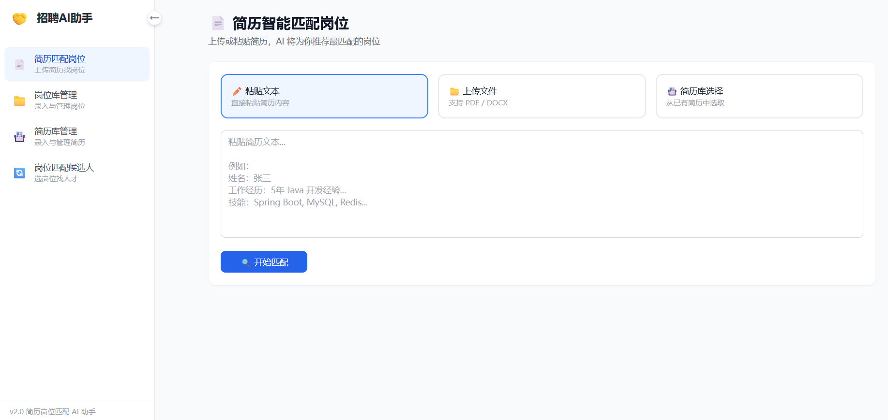
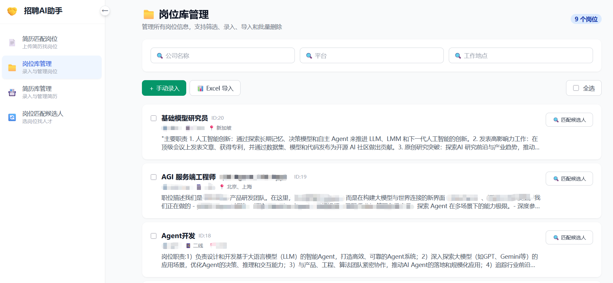
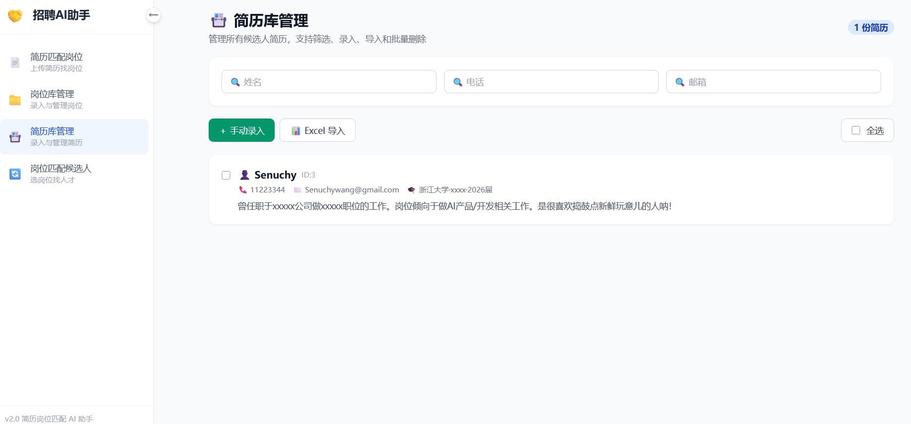

# AI岗位简历匹配助手

[](https://opensource.org/licenses/MIT)
[](https://www.python.org/downloads/)

基于llm服务的智能招聘匹配工具，通过向量检索与 AI 多维度评分，帮助高效匹配候选人与岗位，附加了岗位和简历管理，服务基于openai接口和embedding服务，示例用的混元。碎碎念放在最底下。

已更新至2.0.0版本，该版本废弃了streamlit，前后端分离重构，方便后续迭代更新。

## 功能亮点

- **岗位管理**：手动/Excel 批量录入、向量化存储、筛选、批量删除，支持一键匹配候选人
- **简历管理**：手动/Excel 批量录入、按姓名/电话/邮箱筛选、批量删除、自动向量化
- **多方式简历匹配**：支持粘贴文本、上传 PDF/Word、从简历库选择三种输入方式
- **向量初筛**：基于腾讯混元 Embedding 计算语义相似度，快速缩小候选范围
- **AI 严格评分**：五维度（工作经验/核心技能/教育背景/项目成就/稳定性）综合评估，返回分数、理由与详细分析
- **并发优化**：Top3 岗位/候选人并发调用 AI 评分，大幅缩短等待时间
- **前后端分离**：RESTful API + 现代化前端，便于扩展与二次开发

## 技术栈

| 层级 | 技术 |
|------|------|
| 前端框架 | React 18 + Vite + TailwindCSS + React Router + Axios |
| 后端框架 | FastAPI + SQLite + 腾讯混元 SDK + ThreadPoolExecutor |
| 向量嵌入 | 混元 Embedding API |
| AI 评分 | 混元 Chat API (hunyuan-2.0-instruct) |
| 数据库 | SQLite3 |
| 文件解析 | PyPDF2、python-docx、pandas、openpyxl |
| 部署 | 前端可静态托管，后端使用 uvicorn/gunicorn |

## 快速开始

### 环境要求
- Python 3.8+
- Node.js 16+
- 腾讯云 API 密钥（需开通混元）
- TokenHub API 密钥

### 安装步骤

1. 克隆项目
```bash
git clone https://github.com/Senuchy/hunter-ai-matcher.git
cd hunter-ai-matcher
```
2. 后端配置与启动
```bash
# 进入后端目录（假设后端代码在 backend/ 或根目录，请根据实际调整）
cd backend   # 如果没有该目录，后端代码就在项目根目录

# 安装 Python 依赖
pip install -r requirements.txt

# 配置环境变量
cp .env.example .env
# 编辑 .env 文件，填入 TENCENT_SECRET_ID、TENCENT_SECRET_KEY、TOKENHUB_API_KEY

# 启动后端服务（默认端口 8000）
uvicorn main:app --reload --host 0.0.0.0 --port 8000
```
3. 前端配置与启动
```bash
cp .env.example .env
#编辑.env文件，填入你的API密钥
```
4. 启动应用
```bash
# 打开新终端，进入前端目录
cd frontend

# 安装依赖
npm install

# 启动开发服务器
npm run dev
```
前端默认运行在 http://localhost:5173，会自动代理 API 请求到后端 8000 端口（若需调整请修改 vite.config.js）。

5. 使用

浏览器访问 http://localhost:5173 即可使用全部功能。
## 使用说明
### 1. 简历匹配岗位（默认首页）
- 选择简历输入方式：上传文件 / 直接粘贴 / 从简历库选择

- 点击 「开始匹配岗位」 按钮

- 系统自动完成向量初筛与 AI 并发评分，展示 Top3 推荐结果

- 展开卡片可查看 AI 评分、匹配理由及五维度详细分析

### 2. 岗位库管理
- 手动录入：点击「导入新岗位」→「手动录入」，填写各项信息（岗位名称与 JD 为必填），保存后自动生成向量。

- Excel 批量导入：点击「导入新岗位」→「Excel批量导入」，上传符合模板的 Excel 文件。

- 筛选与删除：使用顶部筛选框快速定位岗位，支持多选批量删除。

- 匹配候选人：点击岗位卡片下方的 「 匹配候选人」 按钮，将跳转至反向匹配页面。
### 3. 简历库管理
- 手动录入：点击「导入新简历」→「手动录入」，填写姓名、简历正文（必填）及其他可选字段。

- Excel 批量导入：点击「导入新简历」→「Excel批量导入」，上传符合模板的 Excel 文件。

- 筛选与删除：支持按姓名/电话/邮箱筛选，支持多选批量删除。
### 4. 岗位匹配候选人
- 从岗位库进入后，页面顶部显示当前岗位信息

- 点击 「开始匹配候选人」，系统计算向量相似度并取 Top10

- AI 对 Top3 候选人进行五维度评分，展示联系方式及详细分析

- 备选区域显示 Top4~10 候选人的向量相似度

## 截图展示

### 📄 简历智能匹配岗位


### 📁 岗位库管理


### 📇 简历库管理



##  项目架构
```text
ai匹配助手
├── 侧边栏导航（页面切换）
├── 简历匹配岗位（首页）
│   ├── 简历输入（文件/粘贴/库选）
│   ├── 向量初筛 → Top5
│   └── AI 并发评分 Top3
├── 岗位库管理
│   ├── 手动录入 / Excel 批量导入
│   ├── 筛选、多选删除
│   └── 跳转匹配候选人
├── 简历库管理
│   ├── 手动录入 / Excel 批量导入
│   ├── 筛选、多选删除
│   └── 向量化存储
└── 岗位匹配候选人
    ├── 向量相似度计算 → Top10
    ├── AI 并发评分 Top3
    └── 候选人详情展示
```
## 项目库结构
```text
hunter-ai-matcher/
├── backend/                 # 后端代码
│   ├── main.py
│   ├── requirements.txt     # 后端依赖
│   └── .env                 # 环境变量（参考 .env.example）
├── frontend/                # 前端代码
│   ├── package.json
│   ├── vite.config.js
│   ├── index.html
│   ├── src/
│   └── ...
├── .env.example             # 环境变量模板（只保留后端需要的）
├── .gitignore               
└── README.md                
```

##  待办事项
- 支持自定义评分维度权重
- 继续优化界面显示体验
- ···

## 更新日志
v2.0.0 (2026-05-22) —— 前后端分离重构

- 架构重构：从 Streamlit 单体应用拆分为 FastAPI 后端 + React 前端

- 前端使用 React 18 + Vite + TailwindCSS，页面切换无刷新，体验更流畅

- 后端提供标准 RESTful API，便于集成与扩展

- 保留所有原有功能（简历/岗位管理、向量匹配、AI 五维度评分、并发优化）

- 添加 CORS 支持，开发环境前后端分离调试

- 优化 Excel 导入的错误提示与进度反馈

- 更新 README 文档，增加前后端启动说明

v1.0.2 (2026-04-28)

- 引入 @st.cache_resource / @st.cache_data 缓存机制（Streamlit 版）

- 缓存失效自动管理，页面切换性能大幅提升

v1.0.1 (2026-04-22)

- 重构为多页面工作台（新增「岗位匹配候选人」反向检索功能）

- 优化界面布局与交互体验


##  贡献
欢迎提交 Issue 和 Pull Request！

##  许可证
本项目采用 MIT License 开源。

## 碎碎念
其实暂时还没帮自己工作什么，暂时是只在看不懂简历（招聘端），以及纠结自己投什么岗位（求职端）的时候，突发奇想想要做一个帮帮忙。但是优化功能可能还需要走一段路程。需要解决的问题还有很多，比如如何花最少的token给出最精准的答案/减少时间/服务器部署否/数据库租用否...之类的，至少自己用起来还不好用，等我觉得好用了，这个项目就打算结束了！（1.0.1）

现在的使用感已经upup了，已经是自己会愿意使用的程度了，omo，争取涵盖完整工作流。页面切换终于不卡了！之前每次点侧边栏都要等好几秒，现在秒切。主要是之前每次 rerun 都重新建数据库连接、重新创建 API 客户端、重新查一遍数据库，现在全缓存起来了。（1.0.2）

又学到一些知识，分开前后端之后，可以考虑更细致优化功能/界面啦,使用上面还好，感觉整个页面的交互还能升级（2.0.0）

